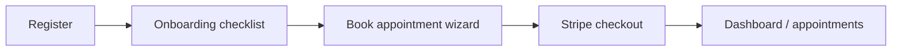

# UX/UI Design Review — Clink / Rebild (Australian Telehealth)

**Review date:** 2026-07-10  
**Reviewer role:** Senior Product Designer, UX Researcher, UI Designer, Frontend Architect, Design System Expert  
**Codebase basis:** `frontend/` (Next.js 16, React 19, Tailwind 4, shadcn radix-maia) + design docs + `LAUNCH_AUDIT_REPORT.md`  
**Recent UI commit reviewed:** `2b28e49` (en-AU formats, shared ops layouts, homepage trust strip, ops table skeletons, patient dashboard asset fixes)

**Method:** File-level inspection of pages, forms, shells, tokens, and components. Not a live staging session, Lighthouse run, or counsel-approved legal review.

**Coverage limits (honest):** Did not execute Twilio video in-browser, full 64-page line-by-line read, or automated axe/Lighthouse. Marketing motion/reduced-motion coverage marked TBD per audit. Backend-only validation rules inferred from frontend + `backend/docs/AU_INTAKE_FIELD_MAP.md`.

---

## Part 0 — Executive Summary & Design System Audit

### Executive summary

Clink has a **coherent visual direction** (calm clinical teal palette, card-based portals, journey rail for patients) and **meaningful recent UX investment** in commit `2b28e49`: shared manager/admin layouts, skeleton-first ops tables, central `format-au` utilities, and a homepage trust strip. The product reads as past MVP with polish on psychologist and patient shells.

The largest UX debt is **form system fragmentation**: the booking intake wizard (`components/patient/booking/booking-wizard.tsx`) is feature-rich but uses bespoke raw inputs, step-scoped error lists, and a schedule-first step order that optimises conversion over clinical intake norms. Meanwhile `components/ui/` ships only **7 primitives** (Button, Card, Badge, Skeleton, Sidebar, ConfirmDialog, AppSonner) while `frontend/docs/ux-standards.md` documents Input, Form, Select, Table, Dialog, and more that are **not present** — leading to ~15+ ad-hoc input class patterns across auth, booking, account, ops, and admin create-user flows.

**AU readiness is partial:** pricing and booking calendar use `en-AU`; `src/lib/format-au.ts` exists but many portal surfaces still use raw `toLocaleString()` or unformatted ISO strings. Intake draft types include `suburb`, `state`, `preferredContactMethod`, and `modality` (`src/patient/booking/types.ts`) but the wizard UI does not collect several of these — a gap vs `AU_INTAKE_FIELD_MAP.md`.

**Recommended design-system north star:** Add a thin **Portal Form Kit** (`FormField`, `TextInput`, `SelectField`, `TextareaField`, `CheckboxField`, `FileUploadField`) backed by tokens + shared validation display, then migrate intake and account flows first. Keep marketing motion separate; portals should prioritise clarity and WCAG over animation.

### Typography

| Aspect | Current state | Gap / recommendation |
|--------|---------------|----------------------|
| **Fonts** | Inter (heading), Noto Sans (body), Geist Mono — wired via layout + `globals.css` `@theme inline` | Good brand fit for AU healthcare; ensure long consent copy uses `leading-relaxed` consistently (booking consent does; ops tables don't) |
| **Scale** | Documented in `layout-sizing-system.md` (h1 32px → caption 12px); portals use `font-heading` + `text-lg` card titles | Marketing heroes may exceed documented scale — acceptable; portal pages mostly comply |
| **Hierarchy** | `PatientPortalPage`, `OpsPortalPage`, `PageHero` provide h1 + subtitle pattern | Some nested cards reuse `text-lg` CardTitle without h2 semantics — audit heading order on psychologist notes and admin cards |
| **en-AU content** | Body copy references Medicare, MHTP, telehealth safety | Use Australian spelling consistently in UI strings ("organise" vs "organize" — spot-check content files) |

### Colors & surfaces

| Token | Source | Usage assessment |
|-------|--------|------------------|
| `--primary` #5FA8A6 | `app/globals.css` | Appropriate CTA colour; not overused on large surfaces ✓ |
| `--surface-1/2/3`, elevation shadows | `globals.css` | `shadow-e1/e2/e3`, `interactive-lift` on cards — good depth system |
| Status: success/warning/info/destructive | `globals.css` | Used in badges and alerts; **inconsistent** success text (`text-emerald-700` hardcoded in account/profile vs `--success` token) |
| Dark mode | `.dark` class via ThemeProvider | Tokens defined; portal testing in dark mode not verified in this review |
| Glass / gradient | `--glass-*`, `--gradient-brand` | Reserved for marketing — aligned with theme-tokens guidance |

**Recommendation:** Replace hardcoded `emerald-*` / `amber-*` in onboarding and account success states with semantic `text-success` / `border-warning` utilities for theme parity.

### Spacing & layout

- **Containers:** `layout-sizing-system.md` defines 1280px app max, 1200px public — `PageContainer` and portal chrome follow this.
- **Rhythm:** Card padding mostly 16–24px; booking wizard uses `space-y-5` / `gap-4` — readable.
- **Shells:** Patient (`patient-shell-layout.tsx`), Psychologist (`psychologist-shell-layout.tsx`), Ops (`manager-shell-layout.tsx`, `admin-shell-layout.tsx` per `2b28e49`) — **ops remount issue addressed** in recent commit; verify perceived navigation speed on staging.
- **Sidebar:** 72px collapsed / 272px expanded — `sr-only` labels present per audit.

### Components in `components/ui/`

| Component | Maturity | Notes |
|-----------|----------|-------|
| `Button` | Strong | CVA variants, focus rings, `asChild` — use as reference for other primitives |
| `Card` | Strong | Used universally; `card-eyebrow` utility in globals |
| `Badge` | Good | Status chips in booking, psychologist profile |
| `Skeleton` | Good | Ops tables, patient dashboard greeting |
| `Sidebar` | Good | Patient/psychologist/ops nav |
| `ConfirmDialog` | Good | Focus trap, used in data-requests — **should be default for destructive ops actions** |
| `AppSonner` | Good | Toasts on profile save; not used consistently on all form success paths |

**Missing vs documented standards:** Input, Textarea, Select, Form/FormField, Alert, Tabs, Dialog (beyond ConfirmDialog), Sheet, Table. Ops `AdminDataTable` is a custom table — fine, but header sort buttons lack `aria-sort`.

### Consistency gaps (design system)

1. **Three input dialects:** `AuthField` (rounded-lg), booking `inputClassName()` (rounded-xl), account/ops (rounded-md h-9) — users perceive these as the same product; they should not look like three apps.
2. **No shared field error pattern:** Booking shows step-level bullet list; auth shows single `role="alert"` line; account mixes inline `formError` paragraph — field-level `aria-describedby` largely absent.
3. **Checkbox styling:** Native checkboxes in booking consent and register terms — no shared `CheckboxField` with hit area and focus ring parity.
4. **Date display:** `formatDateAu` / `formatDateTimeAu` in `src/lib/format-au.ts` — adopted in ops appointments (post-2b28e49) and appointment manage panel; psychologist notes page still has unformatted dates per grep.
5. **Loading patterns:** `DashboardStateBlock` is the de facto standard — good; some psychologist pages use raw "Loading data..." text without skeleton.

### Recommended design system improvements (prioritised)

| Priority | Improvement | Why | Effort |
|----------|-------------|-----|--------|
| **P0** | `FormField` + `TextInput` + `SelectField` wrappers using tokens | Stops visual/behaviour drift across 15+ forms | M |
| **P0** | Field-level validation display contract (error + hint slots) | WCAG 3.3.1/3.3.3; reduces booking abandonment | M |
| **P1** | Add shadcn `Input`, `Textarea`, `Select`, `Checkbox` to `components/ui/` | Matches documented ux-standards; less custom CSS | S |
| **P1** | Semantic Alert component using `--success/--warning/--destructive` | Replace one-off coloured paragraphs | S |
| **P2** | `DataTable` a11y pass (`aria-sort`, scope="col") | Ops scale; screen reader sort state | S |
| **P2** | Document when to use `ConfirmDialog` vs inline form vs toast | Reduces inconsistent feedback | S |

---

## Part 1 — Forms (Highest Priority)

### Form inventory (code-verified)

| # | Location | Type | Primary user |
|---|----------|------|--------------|
| F1 | `components/patient/booking/booking-wizard.tsx` | Multi-step intake + schedule + payment handoff | Patient |
| F2 | `components/marketing/get-matched/get-matched-wizard.tsx` | Quiz + optional registration | Prospective patient |
| F3 | `app/login/page.tsx` | Auth | All roles |
| F4 | `app/register/page.tsx` | Auth + terms consent | New user |
| F5 | `components/auth/forgot-password-form.tsx` | Password reset request | All roles |
| F6 | `components/auth/reset-password-form.tsx` | Password reset completion | All roles |
| F7 | `components/shared/change-password-form.tsx` | Password change | Patient, psychologist |
| F8 | `components/patient/account/patient-account-settings.tsx` | Profile, notifications, data export | Patient |
| F9 | `app/psychologist/profile/page.tsx` | Bio, avatar, password | Psychologist |
| F10 | `app/psychologist/notes/page.tsx` | Session-linked note editor | Psychologist |
| F11 | `components/ops/admin-psychologist-users-card.tsx` | Admin create psychologist | Admin |
| F12 | `app/patient/data-requests/page.tsx` | Privacy access/correction request | Patient |
| F13 | `components/patient/appointments/appointment-manage-panel.tsx` | Reschedule / cancel | Patient |
| F14 | `components/patient/booking/referral-upload.tsx` | PDF upload | Patient |
| F15 | `components/session/chat/chat-conversation-view.tsx` | Message compose | Patient, psychologist |
| F16 | `components/shared/portal-shell-search.tsx` | Global portal search | Portal users |
| F17 | `components/ops/admin-filter-bar.tsx` | Table search + filters | Manager, admin |
| F18 | `components/psychologist/psychologist-notification-prefs-card.tsx` | Notification toggles | Psychologist |
| F19 | Ops queue cards (`intake-queue-card`, `referral-action-card`, etc.) | Action forms / status updates | Manager, admin |

---

### F1 — Booking / intake wizard (deepest analysis)

**Files:** `components/patient/booking/booking-wizard.tsx`, `content/patient-booking.ts`, `src/patient/booking/types.ts`, `src/patient/booking/merge-booking-draft.ts`, `backend/docs/AU_INTAKE_FIELD_MAP.md`

**Purpose & user goal:** Complete Australian telehealth intake, select a real clinician slot, accept consents, pay via Stripe checkout, and become bookable for first or follow-up session.

**Step order (visible steps):**
1. Booking type (`mode`) — skipped for new patients
2. Clinician & schedule (`schedule`)
3. Reason & urgency (`reason`)
4. Medicare & referral (`medicare`)
5. Clinical background & telehealth safety (`clinical`)
6. Referral PDF (`referral`) — conditional
7. Consent (`consent`)
8. Review & submit → Stripe redirect (`review`)

**Current strengths**
- **Progressive disclosure:** Returning follow-up with no changes skips heavy Medicare/clinical fields — reduces cognitive load (`shouldShowReferralStep`, medicare/clinical `requireClinicalUpdate` logic).
- **Dual persistence:** `localStorage` (`clink_booking_draft_v1`) + debounced server draft sync (`saveIntakeDraftDelta`) with `BookingDraftStatus` — supports "save and return" promised in copy.
- **Cross-source prefill:** Merges match quiz, `auth/me`, and remote intake (`mergeBookingDraftFromSources`) — smooth get-matched → booking handoff.
- **AU-aware content:** MHTP, indigenous status (optional), gap pricing examples from `publicPricing`, telehealth safety fields.
- **States:** Loading (`DashboardStateBlock`), schedule skeleton, availability error + retry, payment cancelled banner, step errors, submitting on final step.
- **Accessibility partial wins:** `BookingStepper` with `aria-label`, `aria-labelledby` on step content, `aria-live` on helper text, calendar `aria-label` on month nav.

**Current weaknesses**
- **Schedule-before-identity:** Users pick slot before proving eligibility or completing clinical context. If they abandon mid-intake, held slots may expire — anxiety without clear TTL copy (payment cancel banner mentions "held briefly" but not earlier steps).
- **AU field map gaps:** Types include `patientIdentity.suburb`, `state`, `preferredContactMethod`, `preferences.modality` — **not rendered** in wizard. `currentSessionLocation` conflates suburb+state into one free-text field instead of structured address minimum per field map.
- **Validation UX:** `validateCurrentStep()` returns string array shown as bullet list at top — no field focus jump, no `aria-invalid`, no per-field messages. Mobile users may not see errors without scrolling.
- **Risk flag under-designed:** `urgent_support_needed` option has no crisis pathway (Lifeline 13 11 14, emergency 000, practice after-hours) — critical for AU mental health duty of care UX.
- **Consent without deep links:** Checkbox labels from `bookingContent.consentText` don't link to `/privacy-policy`, `/terms-of-service`, `/telehealth-requirements` inline — harder to make informed consent.
- **Review step raw values:** Shows `MHTP: unsure` enum strings, ISO date without `formatDateAu`, `documentId` exposed to patients — clinical/admin IDs confuse lay users.
- **Input inconsistency:** Local `inputClassName()` duplicates `AuthField` styling; native `<select>` and `<textarea>` without shared component.
- **Timezone:** Hardcoded `Australia/Sydney` in availability — patients in WA/QLD may see wrong implicit TZ unless profile TZ added later.
- **Mobile:** 7-column calendar buttons (`h-10`) are usable but dense; clinician card grid is long before date picker — consider sticky summary of selected slot.
- **Success state rarely seen:** Submit redirects to Stripe; `submitted` step UI exists but checkout flow bypasses it — users may not get in-app confirmation if payment fails silently.

**Loading / empty / error / success**

| State | Implementation | Gap |
|-------|----------------|-----|
| Initial hydrate | `wizardLoading` until eligibility + remote draft | Good |
| Schedule load | `BookingScheduleSkeleton`, `scheduleLoadError` + retry | Fallback to static schedule may show **stale demo slots** without prominent warning |
| Draft sync | `remoteSyncState`: idle/syncing/saved/conflict/error | Conflict UI in `BookingDraftStatus` — verify user-facing recovery steps |
| Step validation | Red destructive box | Needs field linkage |
| Submit | `isSubmitting` on `BookingActions` | No intermediate "holding slot" state |
| Payment cancelled | Amber banner via `?payment=cancelled` | Good recovery cue |

**Proposed improvements (with WHY)**

| Improvement | Why | User benefit | Implementation notes |
|-------------|-----|--------------|----------------------|
| **A. Reorder or defer slot commitment** — Option 1: move schedule after reason+medicare for new patients; Option 2: "soft select" slot, confirm only at review | Healthcare intakes typically establish safety/eligibility before scheduling; reduces slot-timeout stress | Higher completion rate; fewer expired holds | Adjust `bookingSteps` order in `content/patient-booking.ts`; update `validateCurrentStep` order; consider backend slot hold API timing |
| **B. Add suburb + state fields** (dropdown state from `australianStates` in get-matched quiz) | Matches `AU_INTAKE_FIELD_MAP`; supports billing/reporting | Compliance confidence; fewer ops callbacks | Add to `reason` step; validate for initial bookings |
| **C. Field-level errors + focus management** | WCAG; bullet list at top is easy to miss | Faster correction; less frustration | Extract `FieldError` component; on `goNext` failure focus first invalid field |
| **D. Crisis routing panel** when `riskFlag === urgent_support_needed` | AU telehealth safety expectation | Patient safety; trust | Non-blocking info card with 000 / Lifeline / link to contact; optional notify care team flag |
| **E. Consent checkboxes with inline legal links** | Informed consent for health data | Legal clarity pending counsel sign-off | Wrap label text with `Link` to policies; open in new tab |
| **F. Human-readable review summary** | Raw enums erode trust | Confidence before payment | Map `hasMhtp`, referral types to labels; use `formatDateAu` for DOB and appointment |
| **G. Mobile sticky "Your appointment" chip** after schedule step | Long form scroll | Orientation | Small fixed footer showing clinician + date + time |
| **H. Collect `preferredContactMethod` + `modality`** or remove from draft schema | Schema/UI drift causes sync noise | Accurate care coordination | Single select on reason or clinical step |
| **I. AU mobile validation** (`04xx` hint + lenient parse) | Invalid mobiles break SMS reminders | Fewer failed contact attempts | Client hint + server validation alignment |
| **J. Post-checkout return UX** | Users need closure | Clear next steps | Ensure `payment-success` page summarises appointment with `formatDateTimeAu` and link to video-setup |

**Intake progressive disclosure assessment**

| Segment | Steps shown | Cognitive load |
|---------|-------------|----------------|
| New patient | 7–8 steps | **High** — appropriate for first telehealth but needs chunking breaks ("~4 min left") |
| Follow-up, no changes | ~4 steps (schedule, reason light, consent, review) | **Low** — well optimised |
| Follow-up, changes | ~7 steps | **Medium** |

**Field order vs AU expectations:** Identity contact is step 3, after schedule — inverted vs typical paper intake. Medicare before full clinical history is acceptable for rebate-first AU workflows. Emergency contact at clinical step is correct placement but should be visually grouped as "Safety for telehealth".

---

### F2 — Get Matched wizard

**File:** `components/marketing/get-matched/get-matched-wizard.tsx`

**Purpose:** Low-friction matcher quiz → account creation → ranked clinicians → handoff to booking with `?source=match&clinician=`.

**Strengths:** Session persistence (`loadMatchQuizSession`), skips account step if logged in, pushes to intake draft, `QuizChoiceGrid` for scannable choices, state/insurance captured early (good AU context).

**Weaknesses:** Password rules only "8 characters" — weaker than register page; no terms checkbox on account step (register page requires terms); concern seeding from `?condition=` defaults to `"exploring"` not the actual condition slug; results step clinician cards need verified CTA to booking with preselected clinician.

**Recommendations:** Add terms/privacy acceptance on account step; align password policy with register; show "What happens next" before account creation to reduce drop-off; sticky CTA on mobile for "Book with [name]".

---

### F3–F6 — Authentication forms

**Files:** `app/login/page.tsx`, `app/register/page.tsx`, `components/auth/forgot-password-form.tsx`, `components/auth/reset-password-form.tsx`, `components/auth/auth-field.tsx`

**Strengths:** Consistent `AuthShell` + `AuthCard`; `AuthField` with labels and focus rings; login `role="alert"` on error; safe redirect validation; dev-only demo credentials gated to `NODE_ENV === "development"`.

**Weaknesses:** No password visibility toggle; register lacks password strength hint; forgot-password success uses `text-emerald-700` not token; reset form not fully re-read but likely same patterns; no "email sent" inbox guidance for AU users.

**Recommendations:** Add `autocomplete` everywhere (mostly present); success state for forgot-password with spam-folder hint; remove dev reset URL from any production build (audit flags `devResetUrl` backend risk); consider magic-link alternative for mobile-first AU users.

---

### F7 — Change password (shared)

**File:** `components/shared/change-password-form.tsx`

**Strengths:** Internal state isolation; preserves fields on failure; match validation before submit.

**Weaknesses:** No `minLength` hint; submit is button `onClick` not `<form onSubmit>` — Enter key may not submit; no password strength meter.

**Recommendations:** Wrap in `<form>`; add `aria-live` for validation errors from `onValidationError`.

---

### F8 — Patient account settings

**File:** `components/patient/account/patient-account-settings.tsx`

**Purpose:** View/edit display name, contact, emergency contact, accessibility notes, notifications, password, GDPR-style PDF export.

**Strengths:** Clear separation read vs edit panels; explains intake vs account fields; `fieldset`/`legend` on notifications; toast on success; export polling with status.

**Weaknesses:** DOB shown read-only but not editable here (intake-only) — may confuse users wanting correction (should link to data-requests); inline inputs use smallest styling (`text-xs` labels); duplicate emergency contact fields also in booking intake — sync messaging needed.

**Recommendations:** Add "Request correction" link for DOB/legal name; use shared FormField; show last-updated timestamp on profile.

---

### F9 — Psychologist profile

**File:** `app/psychologist/profile/page.tsx`

**Strengths:** Patient-facing preview (`ClinicianPublicProfileHeader`); avatar upload with type/size validation and toast; AHPRA fields read-only with clear copy.

**Weaknesses:** Bio textarea minimal styling; file input `sr-only` with button trigger — good a11y; notification prefs in separate card — fine.

**Recommendations:** Character limit hint on bio; optional preview modal at booking card density.

---

### F10 — Psychologist notes

**File:** `app/psychologist/notes/page.tsx`

**Strengths:** Session selector ties notes to encounters; autosave debounce pattern; patient context sidebar.

**Weaknesses:** Raw `<select>` and `<textarea>`; error "Could not load selected note" without retry; date formatting may be non-AU; high cognitive density for mobile.

**Recommendations:** Split layout collapses to tabs on mobile (Note | Context); explicit Save indicator; use `formatDateTimeAu` in session picker labels.

---

### F11 — Admin create psychologist

**File:** `components/ops/admin-psychologist-users-card.tsx`

**Strengths:** Inline create with disabled state until required fields; search via URL query.

**Weaknesses:** No email format validation; no success toast; create form always visible — accidental submission risk; AHPRA fields without format hints.

**Recommendations:** Collapse create behind "Add psychologist" button; `ConfirmDialog` before create; field-level validation; success toast + clear form.

---

### F12 — Patient data requests

**File:** `app/patient/data-requests/page.tsx`

**Strengths:** Clear access vs correction choice cards; `ConfirmDialog` with textarea; history list with SLA copy; loading/error/empty via `DashboardStateBlock`.

**Weaknesses:** Dialog confirm disabled when details empty — good — but no visible validation message; correction flow hardcodes `requestedCorrection` string in API call.

**Recommendations:** Show inline "Please describe your request" when confirm clicked empty; explain 30-day APP SLA in AU terms.

---

### F13 — Appointment manage (reschedule/cancel)

**File:** `components/patient/appointments/appointment-manage-panel.tsx`

**Strengths:** `formatDateTimeAu` for display; reschedule lock policy surfaced; `RescheduleDatetimeField` component; React Query invalidation.

**Weaknesses:** Cancel without confirmation dialog; `datetime-local` input timezone ambiguity for AU users.

**Recommendations:** `ConfirmDialog` on cancel; show times in explicit timezone label (e.g. AEST/AEDT).

---

### F14 — Referral upload

**File:** `components/patient/booking/referral-upload.tsx`

**Strengths:** PDF-only, 8MB cap, upload progress state, document ID feedback.

**Weaknesses:** Hidden file input inside label — OK; clear removes server-linked doc without confirm; no drag-and-drop (nice-to-have).

**Recommendations:** Warn before remove if `documentId` set; show upload progress bar for slow mobile networks.

---

### F15 — Session chat compose

**File:** `components/session/chat/chat-conversation-view.tsx`

**Strengths:** Locked state countdown; degraded mode handling; scroll-to-bottom on new messages.

**Weaknesses:** Compose area not fully audited; attachment button present — verify size/type limits in UI.

**Recommendations:** Chat input should mirror messaging app patterns (Enter to send, Shift+Enter newline); aria-live for new messages.

---

### F16–F19 — Search & ops filters

**Files:** `portal-shell-search.tsx`, `admin-filter-bar.tsx`, ops queue cards

**Strengths:** URL-synced search on some ops pages; clear filters button.

**Weaknesses:** Search inputs differ stylistically; no search results count; filter bar not sticky on long tables.

**Recommendations:** Unified `PortalSearchInput`; sticky `AdminFilterBar` below ops header on `lg:` breakpoints.

---

## Part 2 — Reusable Components

### Buttons (`components/ui/button.tsx`)

**What's wrong:** Feature code sometimes uses raw `<button>` with ad-hoc classes (calendar days, filter clear).

**Why it matters:** Focus ring and hit target inconsistency.

**Better solution:** Use `Button` variant `outline`/`ghost` for calendar cells or document exceptions in design system.

**Consistency:** Button uses `rounded-4xl` — inputs use `rounded-xl`/`rounded-lg` — intentional tension OK if documented.

---

### Inputs / selects / textareas

**What's wrong:** Not in `components/ui/`; 3+ styling dialects.

**Why:** ux-standards.md promises shadcn Form — not implemented.

**Better solution:** `TextInput`, `SelectField`, `TextareaField` with `size="md"` (40px per layout-sizing-system).

**Consistency:** Auth and booking should share one height (40px default).

---

### Tables (`AdminDataTable`)

**What's wrong:** Sort buttons lack `aria-sort`; no row actions column convention; no pagination (loads full list).

**Why:** Ops users on manager `staff/page.tsx`, `patients/page.tsx` will hit scale issues.

**Better solution:** Add optional pagination props; standard actions column; sticky header on scroll.

**Consistency:** Post-2b28e49 skeleton loading is good — extend to all ops pages uniformly.

---

### Cards

**What's wrong:** Minor — some cards lack `interactive-lift` on ops pages.

**Why:** Visual hierarchy flatter in admin settings vs patient dashboard.

**Better solution:** `AppCard` wrapper enforcing padding + shadow tier.

---

### Shells

| Shell | Assessment |
|-------|------------|
| `PatientShell` | Strong — journey integration, search, notifications, floating chat |
| `PsychologistShell` | Strong — shared layout fix per audit |
| `OpsShell` + layouts | Improved in 2b28e49 — verify active route highlighting |
| `AuthShell` | Strong marketing imagery |
| Public header/footer | Consistent on marketing |

**Issue:** Video session uses different shell per role (`video-session/[appointmentId]/page.tsx`) — ops roles get bare `<main>` without nav — intentional for focus?

---

### Modals (`ConfirmDialog`)

**What's wrong:** Underused — cancel appointment, delete referral, admin create lack confirmation.

**Why:** Prevents costly mistakes in clinical ops.

**Better solution:** Standardise destructive action pattern in ux-standards.

---

### Search (`PortalShellSearch`)

**What's wrong:** Behaviour varies by role; not on ops shell (ops uses per-page `AdminFilterBar`).

**Why:** Users expect global search in header.

**Better solution:** Document scope per role (patient: portal routes; ops: table filter only).

---

### Filters (`AdminFilterBar`)

**What's wrong:** Selects not multi-filter aware; no "active filter chips".

**Why:** Hard to see applied filters on appointments page.

**Better solution:** Filter chip row showing active filters + count.

---

### Toasts (`AppSonner` / `src/lib/toast`)

**What's wrong:** Used on psychologist profile and account saves; missing on booking submit failure recovery, admin create.

**Why:** Toasts reduce need to scroll for success feedback.

**Better solution:** Toast on all successful mutations; error toast + inline for failures.

---

### File uploads

**Referral upload & avatar upload** work but patterns differ (referral uses label dropzone; avatar uses hidden input).

**Better solution:** Shared `FileUploadField` with consistent error/size/type messaging.

---

### Dashboards

| Dashboard | Pattern | Gap |
|-----------|---------|-----|
| Patient (`patient-dashboard-view.tsx`) | React Query + skeleton + journey rail | Resource images fixed in 2b28e49 |
| Psychologist | Cards + pre-session workspace | Good |
| Manager/admin | Snapshot cards + queues | Live API; cards dense on mobile |

---

## Part 3 — Page-by-Page Review

Template: **Current Problems | Proposed Improvements | Component Changes | Expected User Benefit | Implementation Notes**

---

### Marketing

#### Home (`app/page.tsx`)

| | |
|--|--|
| **Problems** | No page-level SEO metadata (audit); heavy motion sections; trust strip new but no AHPRA/ABN in strip itself |
| **Improvements** | `generateMetadata`; verify `motion-reduce` on ScrollSection; extend trust strip with counsel-approved registration identifiers |
| **Components** | `HomeTrustStrip`, `HeroSection` |
| **Benefit** | AU discoverability + trust in first 5 seconds |
| **Notes** | Trust strip at `components/marketing/home-trust-strip.tsx` links to trust/privacy/terms — good |

#### Pricing (`app/pricing/page.tsx`)

| | |
|--|--|
| **Problems** | Audit notes AUD formatting present; sticky mobile CTA not verified |
| **Improvements** | GST clarity banner; link to `/medicare-rebates`; metadata |
| **Components** | `PageHero`, pricing content cards |
| **Benefit** | Informed financial consent before intake |
| **Notes** | Use `formatAud` everywhere |

#### Trust (`app/trust/page.tsx`)

| | |
|--|--|
| **Problems** | Metrics from static content — ensure counsel alignment |
| **Improvements** | Cross-link to data-requests; AHPRA governance copy |
| **Components** | `TrustMetricsSection` |
| **Benefit** | Reduces anxiety for first-time telehealth patients |

#### Get Matched (`app/get-matched/page.tsx` + wizard)

| | |
|--|--|
| **Problems** | Account step terms gap; quiz-to-booking handoff depends on user completing booking |
| **Improvements** | See F2 recommendations; metadata |
| **Components** | `GetMatchedWizard`, `QuizChoiceGrid` |
| **Benefit** | Higher conversion to booked appointment |

#### Conditions (`app/conditions/page.tsx`, `[slug]`)

| | |
|--|--|
| **Problems** | Deep links to booking with `?condition=` seed generic concern text |
| **Improvements** | Map slug to tailored concern chips in booking reason step |
| **Benefit** | Personalisation without extra typing |

#### Medicare Rebates (`app/medicare-rebates/page.tsx`)

| | |
|--|--|
| **Problems** | BR-109/110 not in product UI (entitlement counters) |
| **Improvements** | Explain gap vs rebate clearly; CTA to booking |
| **Benefit** | Sets expectations — audit flags Medicare as partial |

#### Login / Register

| | |
|--|--|
| **Problems** | See F3–F4; register routes patients to `/patient/onboarding` — good |
| **Improvements** | SSO deferred; focus on mobile keyboard types |
| **Benefit** | Faster account creation |

---

### Patient portal

#### Dashboard (`app/patient/dashboard/page.tsx`)

| | |
|--|--|
| **Problems** | Journey rail adds cognitive load for returning users; tutorial CTAs prominent |
| **Improvements** | Collapse journey when `accountSetupComplete`; emphasise next session |
| **Components** | `JourneyRail`, `NextSessionHero`, `BillingSnapshotCard` |
| **Benefit** | Faster path to session join |
| **Notes** | Image 404s addressed in 2b28e49 |

#### Book Appointment (`app/patient/book-appointment/page.tsx`)

| | |
|--|--|
| **Problems** | Entire F1 analysis — highest priority page |
| **Improvements** | Field kit, step reorder, crisis routing |
| **Components** | `BookingWizard` |
| **Benefit** | Completion rate + safety |

#### Appointments (`app/patient/appointments/page.tsx`)

| | |
|--|--|
| **Problems** | Manage panel cancel without confirm; date formatting mixed |
| **Improvements** | ConfirmDialog; `formatSessionRangeAu` everywhere |
| **Components** | `AppointmentManagePanel` |
| **Benefit** | Fewer accidental cancellations |

#### Onboarding (`app/patient/onboarding/page.tsx`)

| | |
|--|--|
| **Problems** | Manual "Refresh status" — friction; depends on intake commit semantics |
| **Improvements** | Auto-refresh on return from booking; progress % from draft completeness |
| **Components** | `PatientOnboardingChecklist` |
| **Benefit** | Clearer setup completion |

#### Account (`app/patient/account/page.tsx`)

| | |
|--|--|
| **Problems** | See F8 |
| **Improvements** | Form kit migration |
| **Benefit** | Easier profile maintenance |

#### Data Requests (`app/patient/data-requests/page.tsx`)

| | |
|--|--|
| **Problems** | See F12 |
| **Improvements** | Validation message in dialog |
| **Benefit** | APP compliance self-service |

#### Invoices (`app/patient/invoices/page.tsx`)

| | |
|--|--|
| **Problems** | Not fully read — likely list pattern |
| **Improvements** | `formatAud`; GST line explanation per audit |
| **Benefit** | Billing transparency |

#### My Clinician (`app/patient/my-clinician/page.tsx`)

| | |
|--|--|
| **Problems** | Depends on `PatientMyClinicianSection` — book CTA should deep link `?clinician=` |
| **Improvements** | Show next session with assigned clinician |
| **Benefit** | Continuity of care |

#### Video Setup (`app/patient/video-setup/page.tsx`)

| | |
|--|--|
| **Problems** | Pre-session tech check separated from session — good; Twilio readiness not verified here |
| **Improvements** | Link from `NextSessionHero` and appointment rows |
| **Components** | `PatientVideoSetupCard` |
| **Benefit** | Fewer session-start failures (audit W20-S5) |

---

### Psychologist portal

#### Dashboard (`app/psychologist/dashboard/page.tsx`)

| | |
|--|--|
| **Problems** | Information density; pre-session card critical |
| **Improvements** | Prioritise today's sessions; en-AU times |
| **Components** | `pre-session-workspace-card.tsx` |
| **Benefit** | Faster session prep |

#### Schedule (`app/psychologist/schedule/page.tsx`)

| | |
|--|--|
| **Problems** | Day navigator UX solid (`psychologist-day-schedule-view.tsx`) |
| **Improvements** | Week view option; timezone label |
| **Benefit** | Caseload scanning |

#### Patients list / detail (`app/psychologist/patients/`)

| | |
|--|--|
| **Problems** | Detail page data-heavy (`patient-intake-summary-card`) |
| **Improvements** | Tabbed layout mobile; intake summary collapsible sections |
| **Benefit** | Faster clinical review |

#### Notes (`app/psychologist/notes/page.tsx`)

| | |
|--|--|
| **Problems** | See F10 |
| **Improvements** | Mobile tabs; AU dates |
| **Benefit** | Documentation efficiency |

#### Messages (`app/psychologist/messages/page.tsx`)

| | |
|--|--|
| **Problems** | Not in `APP_ROUTES` per audit — RBAC risk |
| **Improvements** | Register route; inbox empty state |
| **Benefit** | Secure comms access |

#### Profile (`app/psychologist/profile/page.tsx`)

| | |
|--|--|
| **Problems** | See F9 |
| **Improvements** | Bio limits |
| **Benefit** | Patient trust in clinician |

#### Recordings (`app/psychologist/recordings/page.tsx`)

| | |
|--|--|
| **Problems** | Partially grep'd — uses date formatting |
| **Improvements** | Consistent `formatDateTimeAu` |
| **Benefit** | Clarity |

---

### Manager portal

Grouped pattern: **dashboard**, **staff**, **patients**, **appointments**, **billing**, **referrals**, **resources**, **privacy-requests** — most use `OpsPortalPage` + `AdminFilterBar` + `AdminDataTable` post-2b28e49.

#### Dashboard (`app/manager/dashboard/page.tsx`)

| | |
|--|--|
| **Problems** | Card stack; mobile scroll length |
| **Improvements** | Prioritise intake queue + referrals above fold |
| **Components** | `ManagerOperationsSnapshotCard`, `IntakeQueueCard` |
| **Benefit** | Ops response time |

#### Staff / Patients / Appointments (representative)

| | |
|--|--|
| **Problems** | No row actions to detail; search only; full fetch |
| **Improvements** | Pagination; row click to detail; export |
| **Components** | `AdminDataTable`, `AdminFilterBar` |
| **Benefit** | Governance at scale |

#### Billing / Referrals / Resources

| | |
|--|--|
| **Problems** | Similar table patterns; referral actions in cards |
| **Improvements** | Unified queue component styling |
| **Benefit** | Training cost down for practice managers |

---

### Admin portal

Extends manager patterns plus **users**, **settings**, **audit-logs**, **security-incidents**, **data-deletion**, **analytics**.

#### Users (`app/admin/users/page.tsx`)

| | |
|--|--|
| **Problems** | See F11 — create form UX |
| **Improvements** | Dialog-based create |
| **Benefit** | Fewer mistaken accounts |

#### Settings (`app/admin/settings/page.tsx`)

| | |
|--|--|
| **Problems** | Read-only table — `editable` column but no edit UI |
| **Improvements** | Inline edit for editable domains or hide column |
| **Benefit** | Avoid false affordance |

#### Audit Logs / Security Incidents / Data Deletion

| | |
|--|--|
| **Problems** | High-stakes ops; need confirm on actions |
| **Improvements** | `ConfirmDialog` + reason textarea; en-AU timestamps (partial in 2b28e49) |
| **Benefit** | Compliance traceability |

#### Analytics (`app/admin/analytics/page.tsx`)

| | |
|--|--|
| **Problems** | Not fully read |
| **Improvements** | Chart tokens `--chart-1..5`; accessible tables fallback |
| **Benefit** | Readable insights |

---

### Video session (`app/video-session/[appointmentId]/page.tsx`)

| | |
|--|--|
| **Problems** | Ops roles lose shell; Twilio UX not browser-tested; join gates per audit N9 |
| **Improvements** | `VideoSessionWorkspace` readiness card prominent; minimal chrome; reconnect states |
| **Components** | `pre-session-readiness-card.tsx`, `floating-chat-widget` |
| **Benefit** | Session success rate |
| **Notes** | Manual W20-S5 still required |

---

## Part 4 — User Flows

### First-time onboarding (register → onboarding → booking → payment)

**Friction points**
1. Onboarding doesn't auto-detect partial intake — manual refresh.
2. Booking schedule-first for new patients after mode skip.
3. Payment redirect leaves Clink chrome — users may not return to video-setup.

**Recommendations:** Intake completeness API for onboarding badge; post-payment landing with checklist (account ✓, intake ✓, video test); email confirmation copy.

---

### Intake / booking (returning + match handoff)

**Paths:** Direct, `?source=match`, `?clinician=`, `?condition=`

**Friction:** Draft conflict (`remoteSyncState === conflict`); static schedule fallback looks real; Medicare "unsure" without GP guidance link.

**Recommendations:** Conflict modal with "keep mine / use server"; banner when showing demo schedule; helper link "What is an MHTP?" → `/medicare-rebates`.

---

### Dashboard usage (patient)

**Friction:** Journey rail competes with next session; floating chat appears with eligibility rules users don't understand.

**Recommendations:** Hide journey when complete; tooltip on chat widget eligibility.

---

### Search / filter (ops)

**Friction:** URL search on staff page but not all ops pages; no saved filters.

**Recommendations:** Standardise `useUrlSearchQuery` + filter query params.

---

### Error recovery

**Strengths:** `DashboardStateBlock` retry; booking availability retry; payment cancelled banner.

**Gaps:** Generic "Could not load" without support contact; no global offline indicator.

**Recommendations:** Add `InlineSupportLink` component with practice contact from `publicContactDetails`.

---

### Returning users

**Strengths:** Follow-up booking short path; eligibility prefill from `usePatientBookingEligibility`.

**Gaps:** Email locked in booking but editable in account — potential mismatch.

---

### Psychologist caseload

**Flow:** Dashboard → schedule → patient detail → notes / video

**Friction:** Notes session selector hard on mobile; intake summary long.

**Recommendations:** "Start session" CTA from patient detail when window open.

---

### Ops governance

**Flow:** Dashboard queues → table drill-down → action cards

**Friction:** Queue cards and tables use different visual languages; settings not editable.

**Recommendations:** Shared `OpsQueueRow` pattern; action audit toast.

---

## Part 5 — Prioritized Implementation Roadmap (UX-only)

| Priority | ID | Problem | Why | Solution | Effort | Impact | Pages affected |
|----------|-----|---------|-----|----------|--------|--------|----------------|
| **Critical** | UX-C1 | Booking intake field gaps vs AU map | Compliance + care coordination | Add suburb/state, contact method, field-level errors, crisis routing | L | H | book-appointment |
| **Critical** | UX-C2 | Form primitive fragmentation | Inconsistent a11y and visual trust | Portal Form Kit + migrate booking + auth | M | H | All forms |
| **Critical** | UX-C3 | Booking step order / slot anxiety | Abandonment on long intake after slot pick | Defer slot confirmation or reorder steps | M | H | book-appointment |
| **Critical** | UX-C4 | Consent without policy links | Informed consent UX (legal pending) | Inline links in consent checkboxes | S | H | book-appointment |
| **Critical** | UX-C5 | Risk flag no crisis guidance | Patient safety | Urgent support panel with 000/Lifeline | S | H | book-appointment |
| **High** | UX-H1 | en-AU date inconsistency | AU market expectation | Roll `formatDateAu/DateTimeAu` to all portal lists | M | M | psychologist notes, recordings, messages, ops |
| **High** | UX-H2 | Onboarding manual refresh | Setup completion unclear | Auto-refresh + draft % complete | S | M | onboarding |
| **High** | UX-H3 | Get-matched account terms gap | Registration compliance | Terms checkbox on quiz account step | S | M | get-matched |
| **High** | UX-H4 | Cancel appointment no confirm | Irreversible patient action | ConfirmDialog | S | M | appointments |
| **High** | UX-H5 | Admin create user always visible | Accidental ops errors | Collapsed create + confirm | S | M | admin/users |
| **High** | UX-H6 | Review step shows raw enums/IDs | Trust before payment | Human-readable summary | S | M | book-appointment |
| **Medium** | UX-M1 | Ops tables lack pagination | Scale | AdminDataTable pagination | M | M | manager/*, admin/* tables |
| **Medium** | UX-M2 | Marketing SEO metadata | AU acquisition | generateMetadata per public page | M | M | marketing pages |
| **Medium** | UX-M3 | Journey rail always visible | Returning user clutter | Hide when complete | S | M | patient dashboard |
| **Medium** | UX-M4 | Filter chips missing | Ops filter clarity | Active filter badges | S | M | ops tables |
| **Medium** | UX-M5 | Toast coverage gaps | Feedback consistency | Toast on all saves | S | M | portals |
| **Medium** | UX-M6 | Mobile notes layout | Clinician mobile use | Tabbed notes UI | M | M | psychologist/notes |
| **Low** | UX-L1 | Password visibility toggle | Usability | AuthField enhancement | S | L | login, register |
| **Low** | UX-L2 | Referral drag-and-drop | Convenience | FileUploadField | S | L | booking referral |
| **Low** | UX-L3 | Calendar sticky summary | Mobile booking | Slot chip footer | S | L | book-appointment |
| **Low** | UX-L4 | Sort aria attributes | a11y | AdminDataTable headers | S | L | ops tables |
| **Low** | UX-L5 | Dark mode QA pass | Theme completeness | Visual regression checklist | M | L | all |

*Security/legal items (RBAC, counsel sign-off, SMTP) tracked in `LAUNCH_AUDIT_REPORT.md` — excluded here per scope.*

---

## Part 6 — Cross-Cutting Principles Applied

### Simplicity
Recommendations favour **one Form Kit** over per-page CSS, **shortened follow-up paths** already in code as model for other flows, and **collapsing** admin create forms — remove steps/UI that don't serve a measurable outcome (e.g. hide journey rail when done).

### Clarity
**Human-readable review summaries**, **en-AU dates**, **explicit timezone labels**, and **field-level errors** all reduce ambiguity. Audit-noted mixed locales directly harm clarity for Australian users.

### WCAG 2.2 alignment
- **1.3.1 Info and relationships:** Use `fieldset`/`legend` (notifications good); fix table header semantics.
- **3.3.1 Error identification:** Field-level errors on booking (currently step-level only).
- **3.3.2 Labels or instructions:** Medicare and mobile need hints.
- **2.4.3 Focus order:** Focus first error on step advance.
- **2.3.3 Animation:** Marketing `motion-safe` / `motion-reduce` in booking step transitions — extend to ScrollReveal (TBD verify).

### Mobile-first
Sticky slot summary, tabbed psychologist notes, get-matched sticky CTA, touch-friendly calendar (min 44px — calendar uses 40px `h-10` — bump to `h-11` on `sm:`), and full-width auth buttons already good.

### Reduced cognitive load
Progressive disclosure in booking for follow-ups is **exemplary** — extend with time estimates, group emergency contact fields, and reduce duplicate data entry between intake and account via clearer copy ("We'll copy emergency contact to your account").

### Australian market context
Medicare/MHTP language, indigenous status optional field, telehealth safety, entity name in trust strip, AUD formatting, and crisis resources — all align with local expectations. Gaps: structured address, timezone beyond Sydney, entitlement tracking (BR-109/110), counsel-approved legal copy before launch.

---

## Appendix — Files Not Read in Full

- `app/patient/invoices/page.tsx`, `app/patient/resources/page.tsx`, `app/patient/recordings/page.tsx`
- `components/session/video-session-workspace.tsx` (large)
- `app/admin/analytics/page.tsx`, `app/admin/billing/page.tsx` (partial patterns inferred)
- All `content/*` marketing copy files (sampled via homepage, patient-booking, get-matched)
- Psychologist `messages/page.tsx` body

---

## Return summary (for parent agent)

| Metric | Value |
|--------|-------|
| **Output path** | `/home/ali/Desktop/projects/rebild/UX_DESIGN_REVIEW.md` |
| **Approx. word count** | ~6,400 |

### Top 5 form improvements
1. **Booking wizard:** field-level validation + suburb/state + preferred contact/modality fields per AU intake map  
2. **Portal Form Kit:** unify Input/Select/Textarea/Checkbox across auth, booking, account, admin  
3. **Booking wizard:** reorder or defer slot commitment to reduce abandonment after schedule step  
4. **Consent & crisis UX:** inline legal links on checkboxes + urgent risk crisis routing panel  
5. **Human-readable review + AU formats:** replace raw enums/IDs before Stripe; `formatDateAu` on review step  

### Top 5 page priorities
1. **`/patient/book-appointment`** — intake wizard (conversion, safety, compliance)  
2. **`/patient/onboarding` + `/get-matched`** — funnel into intake  
3. **`/patient/dashboard`** — next-session focus and journey simplification  
4. **Ops patients/appointments tables** (manager + admin) — scale, filters, en-AU dates  
5. **`/video-session/[id]`** — pre-session readiness and join reliability  

---

*Review grounded in codebase state including commit `2b28e49`. Reconcile with counsel-approved copy before production launch per `LAUNCH_AUDIT_REPORT.md`.*

---

## Implementation status (2026-07-10)

Deferred UX roadmap items implemented in `frontend/`:

| ID | Status | Notes |
|----|--------|-------|
| UX-M1 | done | Client-side pagination (25/page) on `AdminDataTable`, admin users card, privacy-requests queue |
| UX-M2 | done | Root + marketing/legal metadata with Open Graph via `content/marketing-metadata.ts` |
| UX-M5 | done | Toasts on booking draft sync failures, admin mutations, notes, reschedule/cancel, data requests |
| UX-M6 | done | Mobile tabbed queue/editor layout on psychologist notes |
| UX-C3 | done | Booking wizard step reorder: intake before schedule |
| UX-L2 | done | Referral PDF drag-and-drop with progress bar |
| UX-L3 | done | Sticky appointment chip on schedule step (mobile scroll) |
| UX-L4 | done | `aria-sort` + keyboard sort on `AdminDataTable` headers |
| UX-L5 | done | Dark-mode token fixes on touched portal forms (warning panels, inputs) |
| Portal Form Kit | done | Extended `portal-form-field.tsx`; migrated account, get-matched, admin create-user, change-password; `AuthField` uses shared input tokens |
