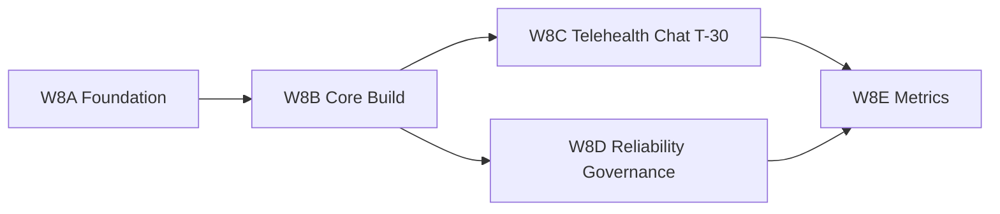

# Wave 8 Implementation Plan

This plan converts Wave 7 requirements into an execution sequence prioritized by P0/P1, with effort estimates and dependencies.

## Planning assumptions

- Team composition:
  - 1 Frontend engineer
  - 1 Backend engineer
  - Shared Product/Clinical/Ops review support
- Sprint unit: 1 week
- Effort scale:
  - `S` = 0.5-1 day
  - `M` = 2-3 days
  - `L` = 4-6 days
  - `XL` = 7-10 days

---

## Wave 8A (P0 Foundation): Lifecycle + Core Contracts

### Objectives

- Freeze lifecycle model and transition ownership.
- Freeze minimal P0 API contracts.
- Align frontend/backend schemas for booking and intake.

### Scope

- Frontend docs and schemas:
  - `WAVE7_REQUIREMENTS_CHECKLIST.md`
  - `WAVE7_REVIEW_NOTES.md`
- Backend docs and contracts:
  - `backend/docs/WAVE7_BACKEND_REQUIREMENTS_CHECKLIST.md`
  - `backend/docs/API_CONTRACT.md` (to add/update in implementation)
  - `backend/docs/API_CONTRACT_MATRIX.md` (to add/update in implementation)

### Work packages

| WP ID | Item | Priority | Owner | Effort | Dependencies |
|---|---|---|---|---|---|
| W8A-01 | Lifecycle state dictionary + transition table finalization | P0 | Product/Ops | M | None |
| W8A-02 | P0 frontend data contract freeze (`BookingRequestDraft` to API payload mapping) | P0 | Frontend | M | W8A-01 |
| W8A-03 | P0 backend entity contract freeze (`PatientProfile`, `IntakeSubmission`, `BookingRequest`, `ReferralDocument`, `ConsentRecord`) | P0 | Backend | L | W8A-01 |
| W8A-04 | API minimum set specification (`/availability`, `/booking-requests`, `/documents/referrals`, `/consents`) | P0 | Backend | L | W8A-03 |
| W8A-05 | Security review for P0 fields and role access matrix | P0 | Security | M | W8A-03, W8A-04 |

### Exit criteria

- Lifecycle and transition spec approved by Product/Clinical/Ops.
- P0 API contracts documented and versioned.
- Security signoff on sensitive fields and role visibility.

---

## Wave 8B (P0 Core Build): Dynamic Availability + Booking Persistence + Referral Pipeline

### Objectives

- Replace static schedule with backend availability source.
- Persist booking requests and status.
- Enable secure referral upload metadata path.

### Work packages

| WP ID | Item | Priority | Owner | Effort | Dependencies |
|---|---|---|---|---|---|
| W8B-01 | Backend `GET /clinicians/availability` | P0 | Backend | L | W8A-04 |
| W8B-02 | Frontend schedule step integration with dynamic availability | P0 | Frontend | L | W8B-01 |
| W8B-03 | Backend `POST /booking-requests` with lifecycle creation | P0 | Backend | L | W8A-03, W8A-04 |
| W8B-04 | Frontend submit flow integration + status handling | P0 | Frontend | M | W8B-03 |
| W8B-05 | Backend `POST /documents/referrals` secure upload + metadata | P0 | Backend | XL | W8A-05 |
| W8B-06 | Frontend referral upload integration to backend response model | P0 | Frontend | M | W8B-05 |
| W8B-07 | Backend `POST /consents` versioned record | P0 | Backend | M | W8A-04 |

### Exit criteria

- Booking uses real availability and persists requests.
- Referral upload works end-to-end with secure metadata storage path.
- Consent records are versioned and linked to booking flow.

---

## Wave 8C (P0 Telehealth Readiness): Pre-Session Window + Chat T-30

### Objectives

- Implement pre-session operational window.
- Implement chat channel timing and policy behavior.

### Work packages

| WP ID | Item | Priority | Owner | Effort | Dependencies |
|---|---|---|---|---|---|
| W8C-01 | Define and implement `TelehealthSessionWindow` state model | P0 | Backend | M | W8A-03 |
| W8C-02 | Chat open rule at T-30 minutes | P0 | Backend | L | W8C-01 |
| W8C-03 | Chat auto-close rules (join/cancel/no-show timeout) | P0 | Backend | M | W8C-02 |
| W8C-04 | Chat role access guard policy | P0 | Backend/Security | M | W8C-02 |
| W8C-05 | Frontend chat state UX (`locked`, `open`, `closed`) | P0 | Frontend | M | W8C-02, W8C-03 |
| W8C-06 | Session location confirmation check before join | P0 | Frontend | M | W8C-01 |

### Exit criteria

- Chat is only open in the correct pre-session window.
- Chat closure behavior is deterministic and auditable.
- Pre-join safety check exists for telehealth session location.

---

## Wave 8D (P1 Reliability + Governance): Audit, Retention, and Error Recovery

### Objectives

- Add resilience and compliance scaffolding.
- Reduce operational risk for sensitive workflows.

### Work packages

| WP ID | Item | Priority | Owner | Effort | Dependencies |
|---|---|---|---|---|---|
| W8D-01 | Append-only transition event logging | P1 | Backend | M | W8B-03 |
| W8D-02 | Field-level audit for sensitive updates | P1 | Backend | L | W8D-01 |
| W8D-03 | Data retention and soft-delete policy implementation plan | P1 | Security/Backend | M | W8A-05 |
| W8D-04 | Frontend robust error recovery for booking submission | P1 | Frontend | M | W8B-04 |
| W8D-05 | Save/resume cross-device contract (`intake-latest` + `intake-delta`) | P1 | Backend/Frontend | L | W8A-04 |

### Exit criteria

- Auditable lifecycle and sensitive field updates.
- Defined retention behavior and data lifecycle controls.
- Improved booking resilience and cross-device continuity.

---

## Wave 8E (P1 Product Intelligence): Metrics and Operational Dashboards

### Objectives

- Enable measurable performance and conversion visibility.

### Work packages

| WP ID | Item | Priority | Owner | Effort | Dependencies |
|---|---|---|---|---|---|
| W8E-01 | Funnel events: visit/register/intake/book/confirm | P1 | Data/Backend | M | W8B-03 |
| W8E-02 | Intake drop-off by step instrumentation | P1 | Frontend/Data | M | W8B-04 |
| W8E-03 | Time-to-first-appointment metric definition + query | P1 | Data/Ops | M | W8B-03 |
| W8E-04 | Referral completeness and no-show reporting | P1 | Data/Ops | M | W8B-05, W8C-03 |
| W8E-05 | Telehealth completion success metric | P1 | Data/Ops | M | W8C-01 |

### Exit criteria

- Product and Ops dashboards have agreed KPI definitions and data feeds.
- Core flow performance is trackable in weekly review.

---

## Dependency map (high-level)

---

## Suggested rollout order

1. Complete all `W8A-*`
2. Execute `W8B-*` in parallel FE/BE tracks
3. Implement `W8C-*` chat and pre-session controls
4. Harden with `W8D-*`
5. Measure with `W8E-*`

---

## Implementation risks

| Risk | Impact | Mitigation |
|---|---|---|
| API contracts drift from frontend assumptions | High | Freeze DTOs and add contract review gate before coding |
| Referral pipeline delayed by storage/security decisions | High | Timebox architecture review and unblock with staged upload path |
| Chat timing edge cases around timezone and status races | Medium | Normalize all timestamps UTC and define deterministic close precedence |
| Lifecycle transitions become inconsistent across modules | Medium | Central transition service + event log validation tests |

---

## Definition of done for Wave 8

- P0 items across Waves 8A/8B/8C are delivered and signed off.
- P1 items have implementation owner, planned sprint, and tracked status.
- API contracts and requirement checklist statuses are updated.
- Clinical/Ops/Security signoff recorded in `WAVE7_REVIEW_NOTES.md`.

